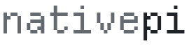
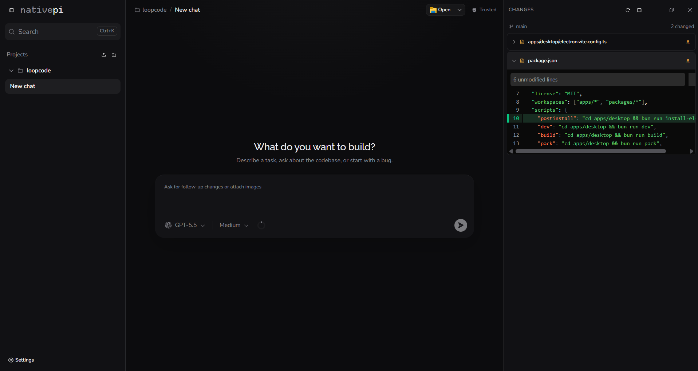

<p align="center">
  
</p>

<p align="center">
  <strong>Pi, at home on your desktop.</strong><br>
  A free, open-source desktop interface for the <a href="https://pi.dev/">Pi coding agent</a> on Windows, macOS, and Linux.
</p>

<p align="center">
  <a href="./LICENSE"></a>
  <a href="https://www.microsoft.com/windows"></a>
  <a href="https://www.apple.com/macos/"></a>
  <a href="https://www.kernel.org/"></a>
</p>

<p align="center">
  <a href="https://www.electronjs.org/"></a>
  <a href="https://react.dev/"></a>
  <a href="https://www.typescriptlang.org/"></a>
  <a href="https://bun.sh/"></a>
</p>

<p align="center">
  <a href="#why-nativepi">Why NativePi</a> ·
  <a href="#features">Features</a> ·
  <a href="#install">Install</a> ·
  <a href="#development">Development</a> ·
  <a href="#architecture">Architecture</a>
</p>

---



NativePi brings projects, conversations, model controls, tool activity, diffs,
authentication, and extensions into one focused workspace, without replacing
the agent that makes Pi powerful.

## Why NativePi

Most agent frontends replace the agent they wrap: their own loop, their own
storage, their own login. NativePi takes the opposite approach.

- **It's all in on extensions.** NativePi extends Pi's extension API into a
  graphical one, so the app itself is hackable. You shape NativePi the same way
  you already shape Pi.
- **Pi stays in charge.** Pi owns the agent loop, providers, auth, tools,
  extensions, and sessions. NativePi calls Pi and renders what Pi returns; each
  NativePi release bundles a tested Pi version.
- **Nothing is locked in.** Sessions and credentials live in Pi's normal
  storage and remain interchangeable with the Pi CLI. NativePi does not create
  a second conversation store.
- **Everything runs on your machine.** No account, no cloud store, no
  telemetry, no NativePi servers.
- **Free and open source.** MIT licensed, from the app down to the extension
  contract.

## Features

| | |
|---|---|
| **Projects and chats, close at hand** | Open local folders, resume Pi sessions, and keep the active conversation in view. |
| **Watch the work, not a spinner** | Follow streamed responses, thinking, tool calls, errors, and file changes as they happen. |
| **Stay in control mid-run** | Send, steer, queue a follow-up, or stop the agent from the same workspace. |
| **The right model for the moment** | Use Pi's providers, models, and thinking levels without rebuilding your configuration. |
| **Full session workflows** | Create, resume, rename, fork, clone, import, export, compact, and inspect session history. |
| **Review code in context** | Inspect Git status and rich diffs alongside the transcript. |
| **Work on the right branch** | Switch or create branches from the composer, and add worktrees from the project menu as projects of their own. |
| **Manage extensions visually** | Install, update, remove, and reload Pi packages; extensions can opt into richer desktop presentation through the graphical API. |

## Install

Download the latest installer for your platform from
[GitHub Releases](https://github.com/nonlooped/nativepi/releases): an `.exe`
for Windows, a `.dmg` for macOS, or an `.AppImage` for Linux. Releases are
currently unsigned (and, on macOS, not notarized), so Windows SmartScreen and
macOS Gatekeeper will warn on first launch.

NativePi bundles Pi. A separate Pi installation is not required, and existing
Pi credentials, configuration, and sessions in `~/.pi/agent` are reused.

After that, NativePi keeps itself current. It checks GitHub for a new release on
startup and every few hours, and tells you when one exists. Nothing is
downloaded until you ask for it, and the update is installed when you choose to
restart. Settings, About has the same controls if you would rather check
yourself.

## Development

To run from source, install [Bun](https://bun.sh/) and Git:

```sh
git clone https://github.com/nonlooped/nativepi.git
cd nativepi
bun install
bun run dev
```

The desktop application lives in `apps/desktop`; the public graphical extension
contract lives in `packages/extension-api`.

### Test and build

```sh
cd apps/desktop && bun test   # run the test suite
cd ../.. && bun run build     # build the app
bun run pack                  # package without installer
bun run dist:win              # build the Windows installer
bun run dist:mac              # build the macOS installer
bun run dist:linux            # build the Linux installer
```

## Architecture

Electron, electron-vite, React 19 with React Compiler, Tailwind CSS 4,
shadcn/ui, Zustand, and Zod. Bun manages the workspace.

```text
┌─────────────────────────────┐
│       React renderer        │
└──────────────┬──────────────┘
               │  Electron IPC
┌──────────────▼──────────────┐
│    Electron main process    │
└──────────────┬──────────────┘
               │  Pi JSON RPC over stdin/stdout
┌──────────────▼──────────────┐
│      Bundled Pi process     │
└─────────────────────────────┘
```

A pinned `@earendil-works/pi-coding-agent` is bundled with the app and started
in RPC mode via `ELECTRON_RUN_AS_NODE`. The desktop renderer talks to the host
through Electron IPC and a constrained `contextBridge`. When browser access is
explicitly enabled, an access-token-protected HTTP and WebSocket server is
opened on the local network until it is stopped or NativePi exits. Remote access
points a throwaway Cloudflare quick tunnel at that same server, so a phone or a
laptop can reach it over HTTPS without a VPN, an account, or an inbound firewall
rule. The tunnel closes itself after twelve hours. While either kind of access
is on, Settings reports how many devices are connected and over which link,
re-checks that the public address still answers, and keeps a record of every
link this window has copied or shown as a QR code. One token backs both links,
so replacing it invalidates everything handed out so far, and revoking closes
the tunnel and the server together.

### Extensions

Normal Pi extensions run inside Pi, unchanged, and their interface arrives with
them. An extension that opens a picker with `ctx.ui.custom()` gets a dialog here
rather than nothing; component widgets, footers and headers take their matching
place around the conversation; a working message or a custom spinner is redrawn
in NativePi's own type; and an extension that registers autocomplete offers its
suggestions in the composer next to commands, skills and files. The component is
drawn by Pi and displayed here as its author wrote it, so an extension written
for the terminal needs no desktop port to be usable.

Two pieces of Pi's terminal interface have no equivalent in a window and keep
Pi's documented no-op: reading raw terminal input, and replacing the input
editor, which here is the composer.

NativePi can also install and manage Pi packages at user or project scope. To
draw with React instead, an extension imports `@nativepi/extension-api` and adds
a `nativepi.renderer` entry to its manifest. NativePi compiles that browser entry
with esbuild and loads its tool, entry, composer-widget, and context-panel
contributions behind error boundaries. The graphical extension API is
experimental and may change between releases.

## License

NativePi is available under the [MIT License](./LICENSE). The bundled Departure
Mono wordmark font is by Helena Zhang and is distributed under the SIL Open Font
License; its license is included beside the font asset.

---

<p align="center">
  Made for people who already shape Pi around their workflow.
</p>
