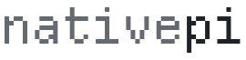
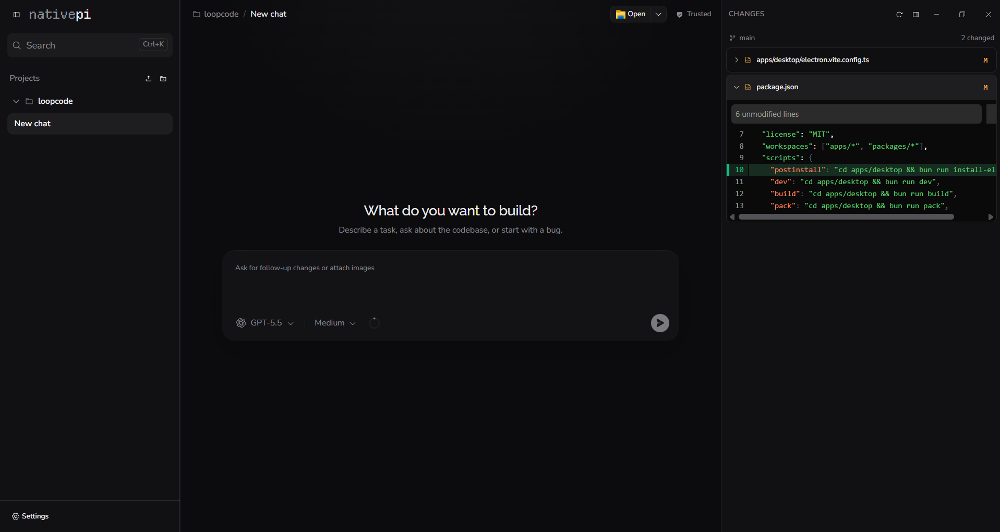

  

  <strong>Your Pi workflow. A desktop workspace.</strong> 
  Free and open source for Windows, macOS, and Linux.

  <a href="https://github.com/nonlooped/nativepi/releases/latest">Download NativePi</a> ·
  <a href="https://nativepi.nonlooped.xyz">Explore the app</a> ·
  <a href="https://nativepi.nonlooped.xyz/docs">Read the guides</a>

Keep your projects, conversations, and code changes in view. NativePi brings the
[Pi coding agent](https://pi.dev/) to your desktop with a workspace you can make
your own.

- **Follow the work.** See responses, tool activity, files, and diffs as Pi works.
- **Pick up where you left off.** Your Pi sessions, models, and configuration
  carry between the desktop and terminal.
- **Make room for your workflow.** Use Pi extensions, add graphical panels, and
  keep terminals and source control beside the conversation.

Pi is included. Your work stays local, and no NativePi account is required.
Choose Stable or Nightly in **Settings → System → Updates** to keep up at your
own pace.

[Contribute](./CONTRIBUTING.md) · [Changelog](./CHANGELOG.md) · [MIT License](./LICENSE)
